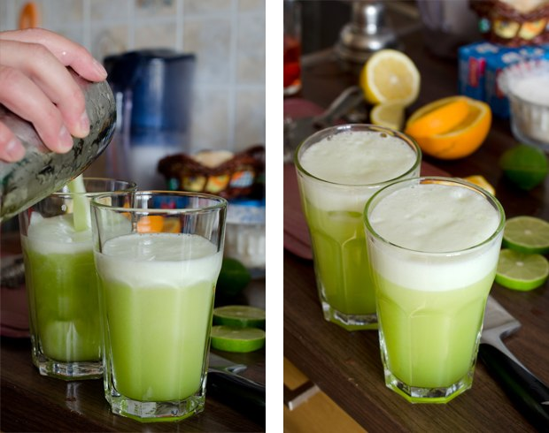
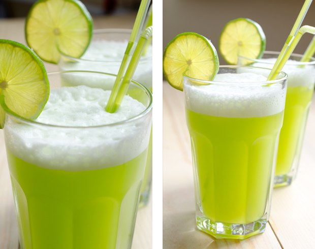
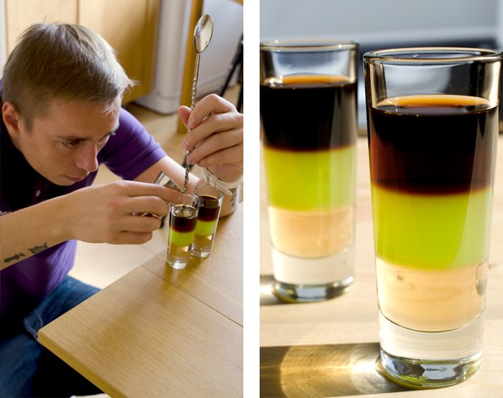

## Cocktails für Programmierer

Ein kulinarisches Projekt für eine professionelle Auszeit - den "Programmierer-Tag", zelebriert am 256ten Tag des Jahres.

Der diesjährige Programmierer-Tag ist Freitag, der 13. September! :)

Dies ist die GitHub-Version für Forks und Pull-Requests.

Original Post: http://habrahabr.ru/post/192942/ (in russisch)

PS: [Großartige Kommentare auf Reddit](http://www.reddit.com/r/programming/comments/1m6n2g/cocktails_for_programmers/)

#### Versionen

* [Pусская версия](README.md)
* [English version](cocktails_for_programers.md)
* [Versão em Português](coqueteis_para_programadores.md)
* [Versiunea Română](cocktailuri_pentru_programatori.md)
* [Versión en Español](cócteles_para_programadores.md)
* [Version in Deutsch](cocktails_fuer_programmierer.md)
* [Version in Chinese](程序员鸡尾酒.md)
* [한국어 버전](프로그래머를_위한_칵테일.md)

### Ruby


```
- 20 mL Malibu (Kokosnusslikör)
- 20 mL Litschilikör
- 40 mL Cognac oder Brandy
- 150 mL Kirschsaft
- Zitrone
- Eis
```

**Anleitung:**

1.  Fülle die Grundzutaten in ein hohes, eisgefülltes Glas.
2.  Mit Zitronensaft abschmecken.
3.  Gewissenhaft mixen, bis das Glas beschlägt.
4.  Mit einer Orangenscheibe und Cocktailkirsche garnieren.

Das Getränk ist süß, duftend und erfrischend. Dieser rubinrote Cocktail passt perfekt zum Ruby-Logo.

### Python

Dieser Cocktail sieht aus wie eine [grüne Python](https://www.google.ru/search?q=green+python&ie=UTF-8&tbm=isch&source=og). :snake:





```
- 50 mL Weißer Rum
- 30 mL Minz Likör
- 30 mL Ananassaft
- Saft einer halben Zitrone
- Sprite oder 7 Up
```

**Anleitung:**

1.  Gewissenhaft mit Eis mixen.
2.  In ein Glas gießen und Sprite oder 7 Up zugeben.
3.  Mit einer Limettenscheibe garnieren.

Dieser Cocktail muss zügig serviert werden - sein Schaum löst sich schnell auf. Das Getränk hat einen erfrischenden Ananasgeschmack.

### Severe Perl

Erinnert an: rau, trocken, Wüste, Kamel.


```
- 30 mL Gin
- 20 mL Trockener Vermouth Rosso
- 20 mL Zitronensaft
- 10 mL Sirup
```

**Anleitung:**

1.  Gewissenhaft mit Eis mixen.
2.  Mit [Physalis](http://en.wikipedia.org/wiki/Physalis) garnieren.

## JMP (aka Assembler)



```
- 20 mL Jägermeister (Kräuterlikör)
- 20 mL Midori (Melonenlikör) + Limette
- 20 mL Pfirsichsirup
```

**Anleitung:**

1.  Gieße alle Zutaten mit Hilfe eines Barlöffels Schicht für Schicht in ein hohes Shot-Glas.

### Profit!

Profit! sollte süß und luftig sein. So haben wir diesen Cocktail kennengelernt.


```
- 20 mL Sahnelikör
- 20 mL Crème de Cassis
- 20 mL Triple Sec
- Schlagsahne
- Kakaopulver
```

**Anleitung:**

1.  Gewissenhaft mit Eis mixen.
2.  Mit Schlagsahne garnieren und Kakaopulver besträuen (nimm ein Sieb zur Hilfe).
3.  Setze eine Kirsche auf die Spitze.

Dieser Cocktail ziemlich süß, mit einem interessanten Geschmack.

### Epic Fail


```
- 50 mL Vodka
- 100 mL Cola
- Saft einer halben Zitrone
- Eis
```

**Anleitung:**

1.  Befülle ein eisgefülltes Glas mit allen Zutaten.
2.  Gewissenhaft mixen, bis das Glas beschlägt.
3.  Mit einer Zitronenscheibe garnieren.

Wie beabsichtigt, kaschieren Zitrone und Cola den Alkoholgeschmack. Wenn man es aber zu weit treibt, endet es in einem echten Epic Fail. Sei vorsichtig, wenn du so etwas ausprobieren willst!

### Memory Leak


```
- 50 mL Tequila
- 50 mL Weißer Rum
- 50 mL Triple Sec
- 50 mL Kahlua
- Limette
- Cola
```

**Anleitung:**

1.  Fülle ein Glas mit Eis und kleinen Limettenstücken.
2.  Füge den Rest der Zutaten zu und mixe.
3.  Mit einer Scheibe Limette garniert, ergibt es einen leckeren und atemberaubenden Drink.

### Cocktails wurden gemacht von

* Making - Artem aka "Salatych ★ Achtyng" [BARaDOMa.net](http://vk.com/baradomanet)
* Photo - Anna Nechaeva. [Anna's open cook](http://open-cook.ru)
* Idea - Ilya Zykin. [github.com/the-teacher](https://github.com/the-teacher)
* English v1.0 - [Sergey Romanov](https://github.com/srg-rmnv)
* English v2.0 - [Trevor Strieber](https://github.com/TrevorS)
* Deutsch - [David Enke](https://github.com/davidenke)

##### Veröffentlicht beim MIT :)


###Probiere es! Sollte eine Menge Arbeit machen und ordentlich reinhaun, aber am Ende ist es sehr zufriedenstellend und entspannend.
