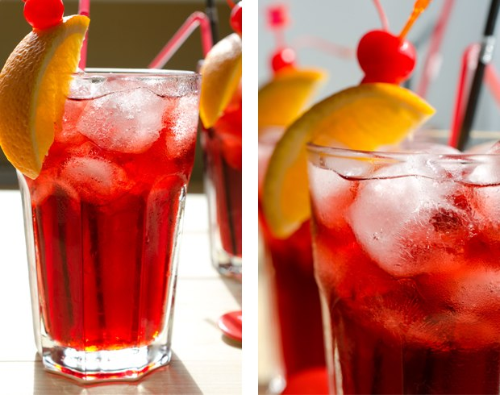
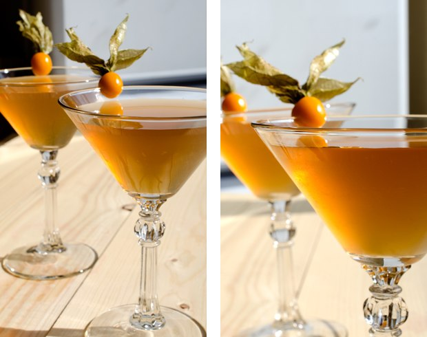
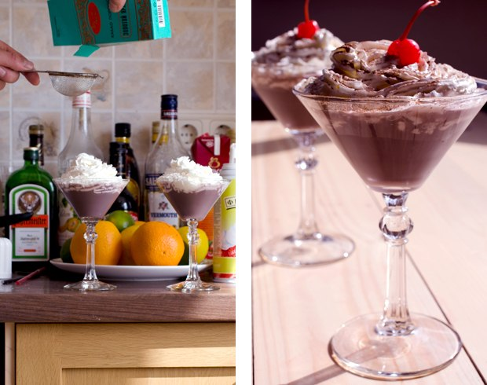

## Cocktails per Programmatori

Un progetto culinario per una festività professionale - "Il giorno del Programmatore", celebrato il 256° giorno dell'anno.

Post originale: http://habrahabr.ru/post/192942/ (in russian)

PS: [Commenti geniali su Reddit](http://www.reddit.com/r/programming/comments/1m6n2g/cocktails_for_programmers/)

#### Versioni

* [Russian version](README.md)
* [English version](cocktails_for_programers.md)
* [Versão em Português](coqueteis_para_programadores.md)
* [Versiunea in Romana](cocktailuri_pentru_programatori.md)
* [Versión en Español](cócteles_para_programadores.md)
* [Version in Deutsch](cocktails_fuer_programmierer.md)
* [Versione Italiana](cocktails_per_programmatori.md)
* [한국어 버전](프로그래머를_위한_칵테일.md)

### Ruby




```
- 20 mL Malibu (Rum al cocco)
- 20 mL Liquore di Litchis (un frutto tipico cinese)
- 40 mL Cognac o Brandy
- 150 mL Succo di Ciliegia
- Limone
- Ghiaccio
```

**Preparazione:**

1.  Aggiungere gli ingredienti dentro un bicchiere da aperitivo riempito di ghiaccio.
2.  Aggiungere succo di limone a piacere.
3.  Mescolare fino a che il vetro del bicchiere non si appanna.
4.  Guarnire con una fettina d'arancia e una ciliegia al maraschino.

La bevanda avrà un gusto dolce, fragrante e fresco. Questo cocktail color rubino si abbina perfettamente al logo di Ruby.

### Python

Questo cocktail deve ricordare il colore del [Pitone Verde](https://www.google.it/search?q=pitone+verde&ie=UTF-8&tbm=isch&source=og). :snake:


```
- 50 mL Rum Bianco
- 30 mL Liquore alla Menta
- 30 mL Succo d'Ananas
- Succo di mezzo Limone
- Sprite o 7 Up
```

**Preparazione:**

1.  Shakerare con ghiaccio.
2.  Versare in un bicchire e aggiungere la Sprite o la 7 Up.
3.  Guarnire con una fettina di limone.

Questo cocktail va servito rapidamente poiché la sua schiuma scompare rapidamente. Gusto di ananas fresco.

### Severe Perl

Associazione: forte, secco, deserto, cammello.




```
- 30 mL Gin
- 20 mL Vermouth Secco Rosso
- 20 mL Spremuta di limone
- 10 mL Sciroppo
```

**Preparazione:**

1.  Shakerare con ghiaccio e versare.
2.  Guarnire con della [physalis](http://it.wikipedia.org/wiki/Physalis).

## JMP (aka Assembler)


```
- 20 mL Jagermeister (liquore alle erbe)
- 20 mL Midori (liquore di melone) + Lime
- 20 mL Sciroppo alla pesca
```

**Preparazione:**

1.  Versare tutti gli ingredienti aiutandosi con un cucchiaio da bar in un bicchiere di vetro strato dopo strato.

### Profit!

Profitto! dovrebbe essere dolce e fresco. Ecco come abbiamo pensato questo cocktail.



```
- 20 mL Crema al Whiskey
- 20 mL Crème de Cassis (liquore rosso al ribes)
- 20 mL Triple Sec
- Panna montata
- Polvere di cocco
```

**Preparazione:**

1.  Shakerare con ghiaccio e versare.
2.  Guarnire con pana montata e spolverare con il cocco (utilizzare un setaccio per un risultato migliore).
3.  Una ciliegina decorativa non guasta.

Questo cocktail è molto dolce e ha un gusto molto interessante.

### Epic Fail


```
- 50 mL Vodka
- 100 mL Coca Cola
- Succo di mezzo limone
- Ghiaccio
```

**Preparazione:**

1.  Riempire un bicchiere con ghiaccio e gli ingredienti.
2.  Mescolare fino a che il vetro del bicchiere non si appanna.
3.  Guarnire con una fettina di limone.

Come da progetto, il limone e la Coca Cola nascondono il gusto dell'alcol. Ovviamente, un abuso di questo cocktail porta ad un vero e proprio fallimento epico. Fate attenzione se volete provare qualcosa di simile!

### Memory Leak


```
- 50 mL Tequila
- 50 mL Rum bianco
- 50 mL Triple Sec
- 50 mL Kahlua
- Lime
- Coca Cola
```

**Directions:**

1.  Riempite un bicchiere con ghiaccio e piccoli pezzettini di lime.
2.  Aggiungete il resto degli ingredienti e mescolate.
3.  Guarnite con una fettina di lime e avrete un cocktail sorprendente e gustoso.

### Cocktails è realizzato da

* Making - Artem aka "Salatych ★ Achtyng" [BARaDOMa.net](http://vk.com/baradomanet)
* Photo - Anna Nechaeva. [Anna's open cook](http://open-cook.ru)
* Idea - Ilya Zykin. [github.com/the-teacher](https://github.com/the-teacher)
* English v1.0 - [Sergey Romanov](https://github.com/srg-rmnv)
* English v2.0 - [Trevor Strieber](https://github.com/TrevorS)
* Italiano - [MiPnamic](https://github.com/MiPnamic)

##### Pubblicati da MIT :)
