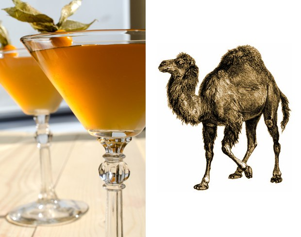
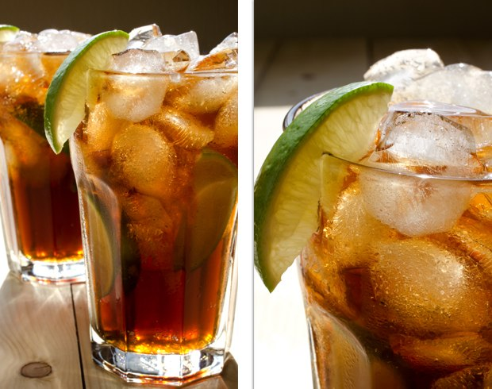

## Cócteles para programadores

Un proyecto culinario para un día festivo profesional, "Día del programador", celebrado el día 256 del año.

¡El Día del Programador de este año es el 13 de Septiembre! :)

Aquí está la versión de GitHub para forks and pull-requests.

Publicación Original: http://habrahabr.ru/post/192942/ (en ruso)

P.D: [Buenos comentarios en Reddit] (http://www.reddit.com/r/programming/comments/1m6n2g/cocktails_for_programmers/) (inglés)

#### Versiones

* [Pусская версия](README.md)
* [English version](cocktails_for_programers.md)
* [Versão em Português](coqueteis_para_programadores.md)
* [Versiunea Română](cocktailuri_pentru_programatori.md)
* [Versión en Español](cócteles_para_programadores.md)
* [Version in Deutsch](cocktails_fuer_programmierer.md)
* [Version in Chinese](程序员鸡尾酒.md)
* [한국어 버전](프로그래머를_위한_칵테일.md)

### Ruby


```
- 20 mL Malibú (licor de coco)
- 20 mL Licor de Lichi (una fruta asiatica)
- 40 mL Coñac o Brandy
- 150 mL Jugo de Cereza
- Limón
- Hielo
```

**Instrucciones:**

1.  Añade los ingredientes a un vaso con hielo.
2.  Agrega jugo de limón al gusto.
3.  Mezcla hasta que el vaso esté sudoroso.
4.  Adorna con una rebanada de naranja y una cereza.

La bebida es dulce al gusto y olfato, además de fresca. El color de este coctel combina con el logo de Ruby

### Python

Este cóctel luce como una [pitón verde](https://www.google.ru/search?q=green+python&ie=UTF-8&tbm=isch&source=og). :snake:


```
- 50 mL Ron blanco
- 30 mL Licor de menta
- 30 mL Jugo de piña
- Jugo de medio limón
- Sprite o 7 Up
```

**Instrucciones:**

1.  Mezcla todo junto con Hielo y agitalo.
2.  Sirve en un vaso y agrega la Sprite o 7 Up.
3.  Adorna con una rebanada de lima.

Este cóctel debe servirse rápido, su espuma desaparece rápido. Esta bebida tiene un sabor fresco a piña.

### Severe Perl

Asociaciones: intenso, seco, desierto, camello.




```
- 30 mL Gin
- 20 mL Vermú Rojo
- 20 mL Jugo de Limón
- 10 mL Jarabe
```

**Instrucciones:**

1.  Agita todos los ingredientes con hielo.
2.  Adorna con [physalis](http://en.wikipedia.org/wiki/Physalis).

## JMP (Ensamblador)


```
- 20 mL Jagermeister (licor de hierbas)
- 20 mL Midori (licor de melón) + Lima
- 20 mL Jarabe de Durazno
```

**Instrucciones:**

1.  Sirve todos los ingredientes con una cuchara en un vaso para 'shots' dobles, capa por capa.

### Profit!

La ganancia debería ser dulce y airosa. Así es como vimos este cóctel.


```
- 20 mL Licor cremoso
- 20 mL Crème de Cassis
- 20 mL Triple Sec (Curazao)
- Crema batida
- Escarcha de Cocoa
```

**Instrucciones:**

1.  Mezcla todo junto con hielo y agita.
2.  Adorna con cremad batida y espolvorea con cocoa (Utiliza un tamizado para mejores resultados).
3.  Coloca una cereza en la punta.

Este cóctel es dulce con un sabor interesante.

### Epic Fail


```
- 50 mL Vodka
- 100 mL Refresco de Cola
- Jugo de medio limón
- Hielo
```

**Instrucciones:**

1.  Llena un vaso de hielo con todos los ingredientes.
2.  Mezcla hasta que el vaso esté sudoroso.
3.  Adorna con una rebanada de lima.

Por diseño el limón y el refresco esconden el sabor del alcohol. Pero si te pasas de copas será un verdadero 'Epic fail'. ¡Cuidado si quieres intentar algo como esto!

### Memory Leak



```
- 50 mL Tequila
- 50 mL Ron blanco
- 50 mL Triple Seco
- 50 mL Kahlua
- Lima
- Refresco de Cola
```

**Instrucciones:**

1.  Llena un vaso con hielo y pedacitos de lima.
2.  Agrega el resto de los ingredientes y mezcla.
3.  Adorna con una rebanada de lima y tienes una bebida asombrosa.

### Los cócteles fueron hechos por:

* Creación - Artem aka "Salatych ★ Achtyng" [BARaDOMa.net](http://vk.com/baradomanet)
* Fotografía - Anna Nechaeva. [Anna's open cook](http://open-cook.ru)
* Idea - Ilya Zykin. [github.com/the-teacher](https://github.com/the-teacher)
* Inglés v1.0 - [Sergey Romanov](https://github.com/srg-rmnv)
* Inglés v2.0 - [Trevor Strieber](https://github.com/TrevorS)
* Español v1.0 - [Héctor Gómez](http://twitter.com/hectorgr)

##### Publicado por MIT :)
