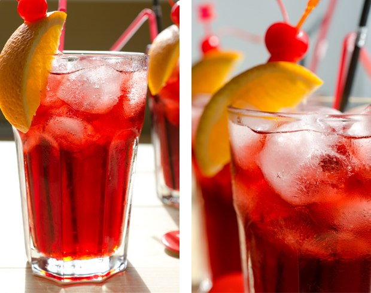
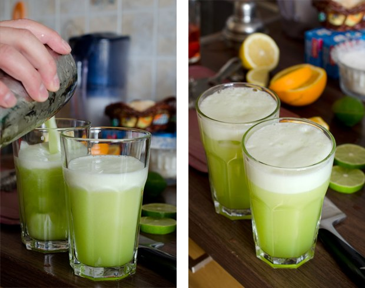
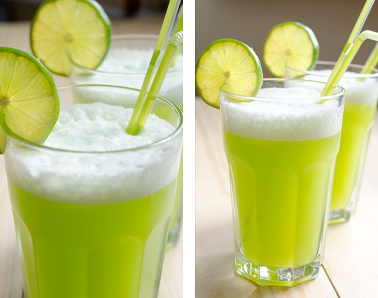
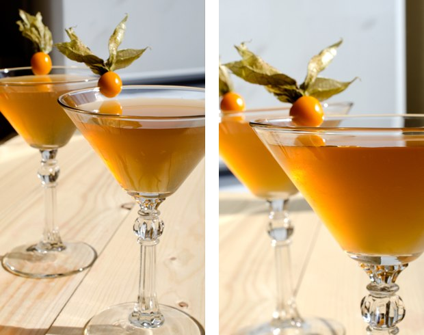
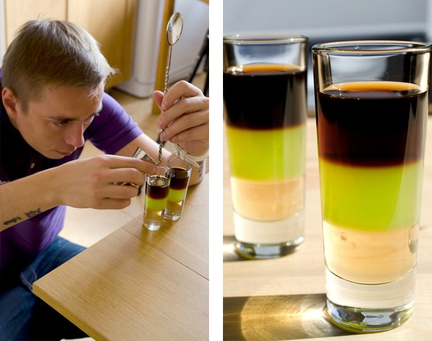
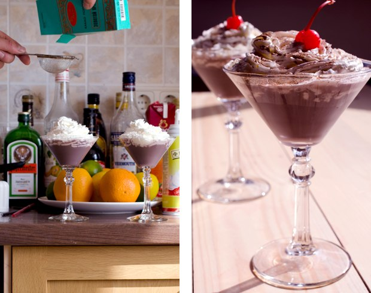
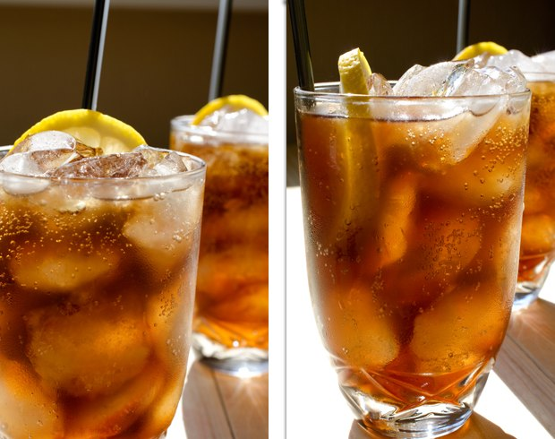
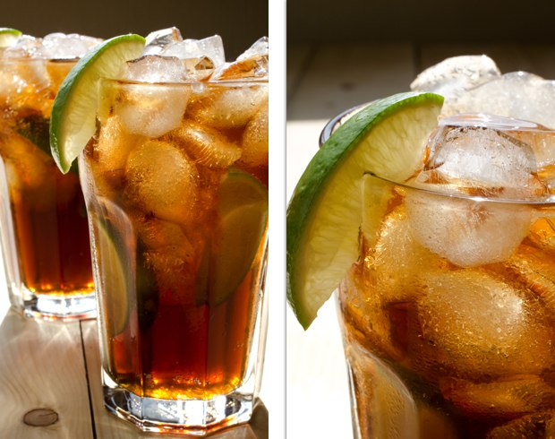

## Coquetéis para Programadores

Um projeto culinário para um feriado profissional - o "Dia do Programador", comemorado no 256º dia do ano.

Nesse ano, o Dia do Programador é na sexta-feira 13 de setembro! :)

Essa é a versão do GitHub para forks e pull-requests.

Post original: http://habrahabr.ru/post/192942/ (in russian)

PS: [Ótimos comentários no Reddit](http://www.reddit.com/r/programming/comments/1m6n2g/cocktails_for_programmers/)

#### Versions

* [Pусская версия](README.md)
* [English version](cocktails_for_programers.md)
* [Versão em Português](coqueteis_para_programadores.md)
* [Versiunea Română](cocktailuri_pentru_programatori.md)
* [Versión en Español](cócteles_para_programadores.md)
* [Version in Deutsch](cocktails_fuer_programmierer.md)
* [Version in Chinese](程序员鸡尾酒.md)
* [한국어 버전](프로그래머를_위한_칵테일.md)

### Ruby




```
- 20 mL Malibu (licor de coco)
- 20 mL Licor de Lichia (uma fruta)
- 40 mL Conhaque ou Brandy
- 150 mL Suco de cereja
- Limão
- Gelo
```

**Modo de preparo:**

1.  Ponha os ingredientes básicos em um copo alto cheio de gelo.
2.  Adicione suco de limão à gosto.
3.  Misture meticulosamente até tomar uma forma enevoada.
4.  Decore o copo com uma fatia de laranja e cereja.

O drink será doce, perfumado e refrescante. Esse coquetel com cor de rubi combina perfeitamente com a logo do Ruby.

### Python

Esse coquetel lembra uma [Píton verde](https://www.google.ru/search?q=green+python&ie=UTF-8&tbm=isch&source=og). :snake:





```
- 50 mL Rum branco
- 30 mL Licor de menta
- 30 mL Suco de abacaxi
- Suco de meio limão
- Sprite ou 7 Up
```

**Modo de preparo:**

1.  Bata os ingredientes com gelo e força.
2.  Coloque em um copo e adicione Sprite ou 7 Up.
3.  Decore com uma fatia de limão.

Esse coquetel deve ser servido rápido - a espuma desaparece rapidamente - e tem um gosto de abacaxi fresco.

### Severe Perl (Pérola Severa)

Associations: austeridade, seco, deserto, camelo.




```
- 30 mL Gin
- 20 mL Vermute vermelho seco
- 20 mL Suco de limão
- 10 mL Syrup/Xarope
```

**Directions:**

1.  Misture tudo com gelo e força.
2.  Enfeite com [physalis](http://en.wikipedia.org/wiki/Physalis).

## JMP (aka Assembler)



```
- 20 mL Jagermeister (licor de hervas)
- 20 mL Midori (licor de melão) + Lima-limão
- 20 mL Calda de pêssego
```

**Modo de preparo:**

1.  Despeje todos os ingredientes com uma Colher de Bar (Bailarina) em um copo alto de dose (shot), camada por camada.

### Profit!

Profit! tem um sabor doce e delicado. Foi assim que nós vimos esse coquetel:



```
- 20 mL Licor cremoso
- 20 mL Crème de Cassis
- 20 mL Triple Sec
- Chantilly
- Chocolate em pó
```

**Modo de preparo:**

1.  Misture os ingredientes com gelo e força.
2.  Decore com chantilly e polvilhe com chcolate em pó (use uma peneira para melhroes resultados).
3.  Coloque uma cereja no topo.

Esse coquetel é bem doce e tem um gosto interessante.

### Epic Fail



```
- 50 mL Vodca
- 100 mL Coca-Cola
- Suco de meio limão
- Gelo
```

**Modo de preparo:**

1.  Encha um copo de gelo com todos os ingredientes.
2.  Misture meticulosamente até tomar uma forma enevoada.
3.  Decore com uma fatia de limão.

Por natureza, o limão e a Coca-Cola escondem o gosto do álcool. Mas se você exagerar na dose, será uma verdadeira falha épica (epic fail). Tome cuidado se você quer tentar algo desse tipo!

### Memory Leak



```
- 50 mL Tequila
- 50 mL Rum branco
- 50 mL Triple Sec
- 50 mL Kahlua
- Lima-limão
- Coca-Cola
```

**Modo de preparo:**

1.  Encha um copo com gelo e pequenos pedaços de lima-limão.
2.  Adicione o resto dos ingredientes e misture.
3.  Decore com uma fatia de lima-limão e você terá uma bebida saborosa e impressionante.

### Os coquetéis foram feitos por

* Making - Artem aka "Salatych ★ Achtyng" [BARaDOMa.net](http://vk.com/baradomanet)
* Photo - Anna Nechaeva. [Anna's open cook](http://open-cook.ru)
* Idea - Ilya Zykin. [github.com/the-teacher](https://github.com/the-teacher)
* English v1.0 - [Sergey Romanov](https://github.com/srg-rmnv)
* English v2.0 - [Trevor Strieber](https://github.com/TrevorS)

##### Publicado pelo MIT :)
