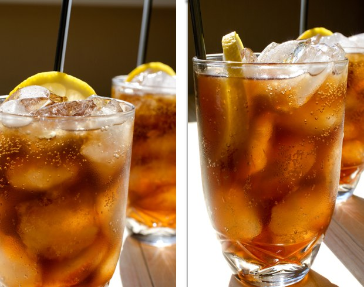

## Koktajle dla programistów

Kulinarny projekt na profesjonalne święto - "Dzień programistów", celebrowany 256 dnia roku.

W tym roku będziemy je obchodzić 13 sierpnia! :)

Tutaj jest wersja na GitHubie dla forków i pull-requestów.

Oryginalny post: http://habrahabr.ru/post/192942/ (po rosyjsku)

PS: [Świetne komentarze na Reddit](http://www.reddit.com/r/programming/comments/1m6n2g/cocktails_for_programmers/)

#### Wersje

* [Pусская версия](README.md)
* [English version](cocktails_for_programers.md)
* [Versao em Portugues](coqueteis_para_programadores.md)
* [Versiunea Română](cocktailuri_pentru_programatori.md)
* [Versión en Espanol](cócteles_para_programadores.md)
* [Version in Deutsch](cocktails_fuer_programmierer.md)
* [Version in Chinese](程序员鸡尾酒.md)
* [Wersja po polsku](koktajle_dla_programistow.md)
* [한국어 버전](프로그래머를_위한_칵테일.md)

### Ruby


```
- 20 ml Malibu (likieru kokosowego)
- 20 ml likieru z liczi
- 40 ml koniaku lub brandy
- 150 ml soku wiśniowego
- cytryna
- lód
```

**Wykonanie:**

1.  Wlać podstawowe składniki do wysokiej szklanki z lodem.
2.  Dodać sok z cytryny dla smaku.
3.  Dokładnie wymieszać.
4.  Udekorować, najlepiej plastrem pomarańczy i wiśnią.

Drink jest słodki, pachnący i odświeża. Koktajl w tym kolorze doskonale pasuje do logo Ruby.

### Python

Ten koktajl wygląda jak [zielony pyton](https://www.google.ru/search?q=green+python&ie=UTF-8&tbm=isch&source=og). :snake:


```
- 50 ml białego rumu
- 30 ml likieru miętowego
- 30 ml soku z ananasa
- sok z połówki cytryny
- Sprite lub 7 Up
```

**Wykonanie:**

1.  Wstrząsnąć razem z lodem i przecedzić.
2.  Wlać do szklanki i dodać jeden z napojów.
3.  Ozdobić plastrem limonki.

Koktajl musi być podany szybko, gdyż jego pianka bardzo szybko znika. Drink ten ma świeży, ananasowy smak.

### Ciężki Perl


```
- 30 ml ginu
- 20 ml słodkiego wermutu (aka Rosso)
- 20 ml soku z cytryny
- 10 ml syropu
```

**Wykonanie:**

1.  Wstrząsnąć razem z lodem i przecedzić.
2.  Udekorować [miechunką](http://pl.wikipedia.org/wiki/Miechunka).

## JMP (aka Assembler)


```
- 20 ml Jägermeistera (likieru ziołowego)
- 20 ml Midori (likieru melonowego) + cytryna
- 20 ml syropu brzoskwiniowego
```

**Wykonanie:**

1.  Wlać wszystkie składniki do wysokiego kieliszka, warstwa po warstwie.

### Zysk!

Zyski powinny być słodkie i przewiewne. Oto, jak widzieliśmy koktajl:


```
- 20 ml likieru kremowego
- 20 ml Creme de Cassis (likieru z czarnych porzeczek)
- 20 ml Triple Sec (słodkiego likieru pomarańczowego)
- bita śmietana
- kakao w proszku
```

**Wykonanie:**

1.  Wstrząsnić wszystkie składniki wraz z lodem i przecedzić.
2.  Udekorować bitą śmietaną i posypać kakao w proszku.
3.  Udekorować wisienką.

Koktajl jest słodki i ma ciekawy smak.

### Epic Fail



```
- 50 ml wódki
- 100 ml coli
- sok z połówki cytryny
- lód
```

**Wykonanie:**

1.  Napełnić szklankę lodem i wszystkimi składnikami.
2.  Dokładnie wymieszać, aż szkło stanie się zamglone.
3.  Udekorować plastrem cytryny.

Zgodnie z projektem, cytryna i cola ukryją smak alkoholu, więc po kilku takich drinkach możecie być pewni, że zaliczycie EPIC FAIL!

### Memory Leak


```
- 50 ml tequili
- 50 ml białego rumu
- 50 ml Triple Sec (słodkiego likieru pomarańczowego)
- 50 ml Kahlúa (słodkiego likieru kawowego)
- cytryna/limonka
- cola
```

**Wykonanie:**

1.  Wypełnić szklankę lodem i małymi kawałkami cytryny.
2.  Dodać resztę składników i wymieszać.
3.  Udekorować plastrem cytryny/limonki.

Wspaniały i smaczny drink!

### Koktajle zostały wykonane przez:

* Twórca - Artem aka "Salatych ? Achtyng" [BARaDOMa.net](http://vk.com/baradomanet)
* Zdjęcia - Anna Nechaeva. [Anna's open cook](http://open-cook.ru)
* Pomysł - Ilya Zykin. [github.com/the-teacher](https://github.com/the-teacher)
* English v1.0 - [Sergey Romanov](https://github.com/srg-rmnv)
* English v2.0 - [Trevor Strieber](https://github.com/TrevorS)

##### Opublikowano na licencji MIT :)


###Opublikuj to! Zajmuje to wiele pracy i nieźle kopie, ale w końcu jest absolutnie satysfakcjonujące i łagodzi :D
