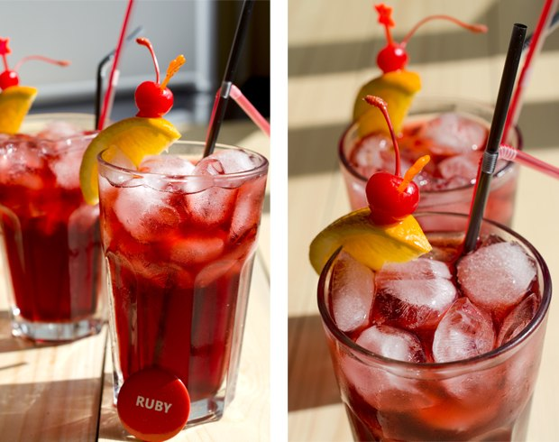

## Programcılar için kokteyller

Bu proje her yılın 256. gününde kutlanan "Programcılar Günü" için düşünülmüş bir mutfak sanatları projesidir.

Bu yıl Programcılar Günü 13 Eylül Cuma gününe denk geliyor! :)

Bu depo da projeyi çatallamanız ve kendi dilinizi eklemeniz için GitHub sürümü.

Özgün ileti: http://habrahabr.ru/post/192942/ (rusça)

Not: [Reddit'teki yorumlar](http://www.reddit.com/r/programming/comments/1m6n2g/cocktails_for_programmers/)

#### Diğer diller

* [Rusça](README.md)
* [İngilizce](cocktails_for_programers.md)
* [Portekizce](coqueteis_para_programadores.md)
* [Romanca](cocktailuri_pentru_programatori.md)
* [İspanyolca](cócteles_para_programadores.md)
* [Almanca](cocktails_fuer_programmierer.md)
* [Çince](程序员鸡尾酒.md)
* [Türkçe](programcılar_için_kokteyller.md)
* [한국어 버전](프로그래머를_위한_칵테일.md)

### Ruby




```
- 20 mL Malibu (hindistan cevizi likörü)
- 20 mL Lychee Likörü (bir meyve)
- 40 mL Konyak veya Brandy
- 150 mL Vişne suyu
- Limon
- Buz
```

**Tarif:**

1.  Limon hariç bütün malzemeleri buzla dolu büyük bir bardağa koyun.
2.  Limonu sıkarak dilediğiniz kadarını bardağa ekleyin.
3.  İçeceğiniz kıvama gelinceye kadar karıştırın.
4.  Bir dilim portakal ya da maraschino vişnesiyle süsleyin.

İçeceğiniz tatlı ve taze bir aromaya sahip olacak. Kızıl rengiyle Ruby logosuna harika uyacak.

### Python

Bu kokteyl aynı [yeşil piton](https://www.google.ru/search?q=green+python&ie=UTF-8&tbm=isch&source=og) gibi gözüküyor. :snake:


```
- 50 mL Beyaz Rom
- 30 mL Nane Likörü
- 30 mL Ananas suyu
- Yarım limonun suyu
- Sprite veya 7 Up
```

**Tarif:**

1.  Malzemeleri buzla çalkalayın ve bir bardağa koyun.
2.  Bardağa Sprite ya da 7 Up ekleyin.
3.  Birkaç dilim yeşil limon ile bardağı süsleyin.

Bu kokteyl taze ananas suyu tadında ve hızlı servis etmelisiniz çünkü köpüğü çok çabuk sönüyor.

### Keskin Perl

Çağrışımlar: keskin, sek, çöl, deve.


```
- 30 mL Cin
- 20 mL Sek İtalyan Vermut
- 20 mL Limon suyu
- 10 mL Şurup
```

**Tarif:**

1.  Malzemeleri buzla iyice çalkalayın ve bardağa koyun.
2.  [Güveyfeneri](http://tr.wikipedia.org/wiki/Güveyfeneri) ile süsleyin.

## JMP (Assembler olarak da bilinir)


```
- 20 mL Jagermeister
- 20 mL Midori (kavun likörü) + Yeşil limon
- 20 mL Şeftali Şurubu
```

**Tarif:**

1.  Bütün malzemeleri uzun bir shot bardağına kaşıkla katman katman koyun.

### Kâr!

Kâr! tatlı ve havalı olmalı, bize göre kokteyl dediğin budur.


```
- 20 mL Kremalı Likör
- 20 mL Crème de Cassis (kuş üzümü likörü)
- 20 mL Triple Sec (portakal likörü)
- Kremşanti
- Kakao tozu
```

**Tarif:**

1.  Malzemeleri buzla karıştırın ve bardağa koyun.
2.  Üstüne kremşanti sıkın ve kremanın üzerine kakao tozunu serpin.
3.  Kremanın üstüne bir vişne koyarak süsleyin.

Bu kokteyl enterasan tatlı bir tada sahiptir.

### Epic Fail


```
- 50 mL Votka
- 100 mL Kola
- Yarım limon suyu
- Buz
```

**Tarif:**

1.  Bütün malzemeleri bir bardağa koyun.
2.  Malzemeler karışana kadar karıştırın.
3.  Bir dilim limonla bardağı süsleyin.

Tasarımı itibariyle limon ve kola alkolün tadını gizler. Fakat fazla içerseniz gerçek manada epic fail olacaktır. Bu tarz kokteylleri denerken dikkatli olun!

### Bellek sızıntısı


```
- 50 mL Tekila
- 50 mL Beyaz Rom
- 50 mL Triple Sec (portakal likörü)
- 50 mL Kahlua
- Yeşil limon
- Kola
```

**Tarif:**

1.  Bardağı buz ve küçük yeşil limon parçalarıyla doldurun.
2.  Kalan malzemeleri de bardağa ekleyin ve karıştırın.
3.  Bir dilim yeşil limon ile bardağı süsleyin.

### Buradaki kokteyllerin alındığı kaynaklar

* Making - Artem aka "Salatych ★ Achtyng" [BARaDOMa.net](http://vk.com/baradomanet)
* Photo - Anna Nechaeva. [Anna's open cook](http://open-cook.ru)
* Idea - Ilya Zykin. [github.com/the-teacher](https://github.com/the-teacher)
* English v1.0 - [Sergey Romanov](https://github.com/srg-rmnv)
* English v2.0 - [Trevor Strieber](https://github.com/TrevorS)

##### MIT lisansı altında yayınlanmıştır :)


### Ship it! Bolca efor sarfedecek fakat karşılığını alacaksınız, sonuçlar sizi tatmin edecek ve rahatlatacak.
